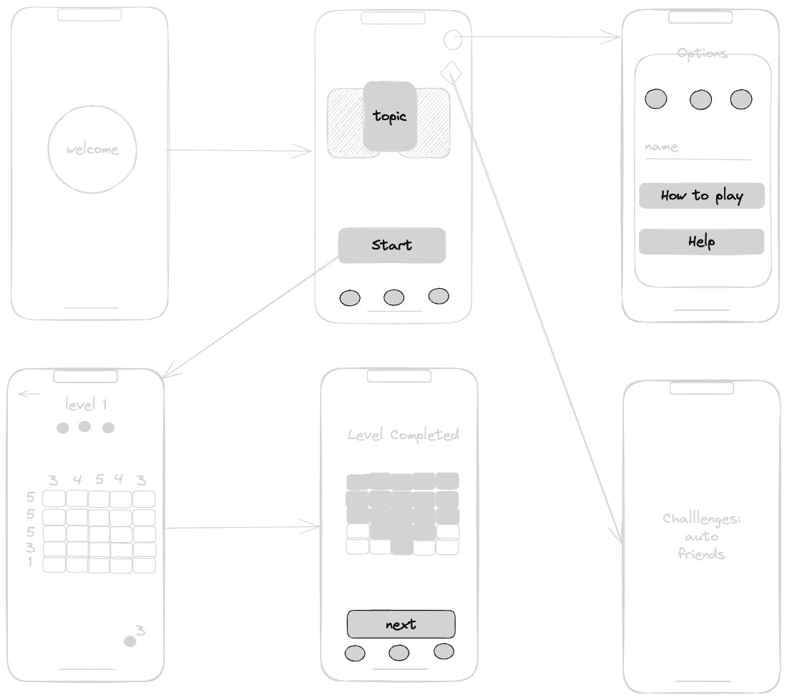

# game_flutter: Nonogram
Nonogram is a game based on Japanese classic crossword puzzles, also known as "nonograms" or "picross." In this game, you solve logical puzzles by filling in a grid based on the number clues provided along the rows and columns.
## Installation
//write late

## Usage
Wireframe -  https://excalidraw.com/#json=RwXLIuFCN8JXnYd-trREH,yCr8cq2TIxY1LThll3Z1qw

video - lesson9 - 

## Gameplay

- The main objective of the game is to solve the logical puzzle by filling in the grid according to the number clues provided on the left and above the grid.
- Each row and column has numbers indicating how many blocks need to be filled and how many of them can be separated from each other.
- Complete the puzzle when all cells are correctly filled.

## Features

- Fun and diverse puzzles that require logical thinking and attention to detail.
- Hint system and the ability to undo moves.
- The ability to play with friends.

## Contact Information

If you have any questions or need assistance, feel free to contact me at dumanskayaolha@gmail.com.

